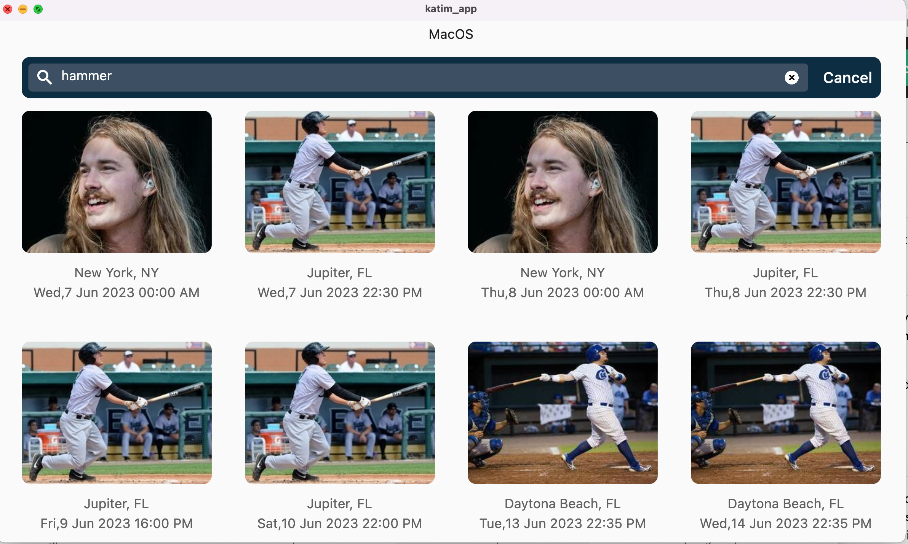
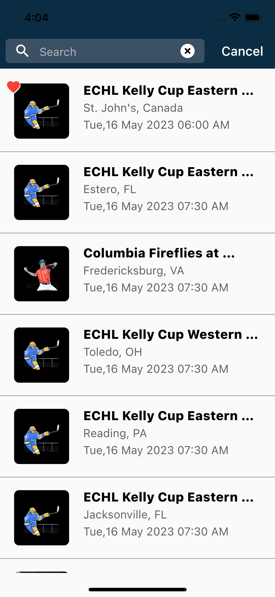

# Katim Flutter App

## Overview
Flutter is Google's UI toolkit for building beautiful, natively compiled applications for mobile, web, desktop, and embedded devices from a single codebase.

This demo app is compatible with iOS, MacOS, Android, and Flutter Web, with support for mobile, tablet, and web with the help of a responsive UI.
## Architecture
The architecture of the template facilitates separation of concerns and avoids tight coupling between it's various layers. The goal is to have the ability to make changes to individual layers without affecting the entire app. Clean Architecture is used to achive the same.

layers
1. presentaiton: All UI and state management elements like widgets, pages and view models.

2. domain: Use cases for individual pieces of work.

3. infrastructure: Services provide access to external elements such as databases, apis, etc.
database-floor: Floor as the Database provider
network-retrofit: Retrofit as the Database provider

## App Features
1. EventListing : In this module, you can see the below features:
    - Listing of events that are getting fetched by the API
    - Type Ahead is the main feature of this module, in which you can search for an event by typing in the search bar.
    - This main listing of events also has a pagination feature so that you can see more events as you scroll to the end.

2. Event Details: The event details show all the details related to the event.

## Responsive UI
App has rsponsive UI when running in any browser it can adapt the UI according to screen size.The UI can be render in Mobile,Tablet and Web When running in browser.

## Libraries used 
Dependency Injection - Provider
Network - Dio
Database - Hive
State managment - Provider

## Screenshots

